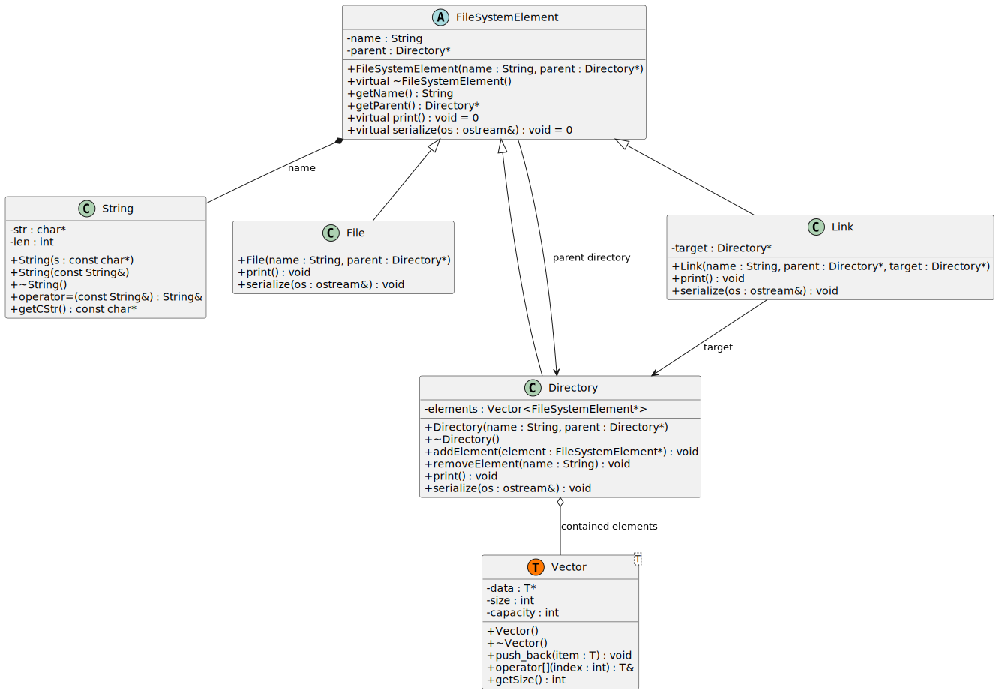

# unix-fs-sim

A C++ implementation of a hierarchical filesystem simulator. It manages files, directories, and symbolic links in memory with a custom serialization engine for state persistence.

## Features

- **Standard Navigation**: Supports absolute and relative path resolution (including `..`).
- **File Operations**: Implements `mkdir`, `touch`, `ls`, `rm`, `cd`, `ln`, and `mv`.
- **Memory Management**: Recursive cleanup of directory structures to prevent memory leaks.
- **Persistence**: Automated state serialization to and from `filesystem.dat`.
- **I/O Redirection**: Standard streams are fully redirectable for batch processing.

## Implementation Details

The project is designed with zero external dependencies to ensure portability and minimal runtime overhead.

### Custom Data Structures
To comply with specific technical constraints, no STL containers are used. The following structures are implemented from scratch:
- **`Vector<T>`**: A generic, dynamically resizing array.
- **`String`**: A memory-managed character array for path and name storage.

### Class Hierarchy
The system uses a polymorphic model based on a common interface:
- `FileSystemElement`: Abstract base class for all filesystem nodes.
- `Directory`: Container node for managing collections of elements.
- `File`: Terminal data unit.
- `Link`: Reference node for directory-level cross-linking.

## Usage

### Building the Project

```bash
g++ -o fs_sim src/*.cpp
```

## Architecture Visualization

The system's class structure follows a strict inheritance hierarchy to ensure type safety and polymorphic behavior across different filesystem entries.

